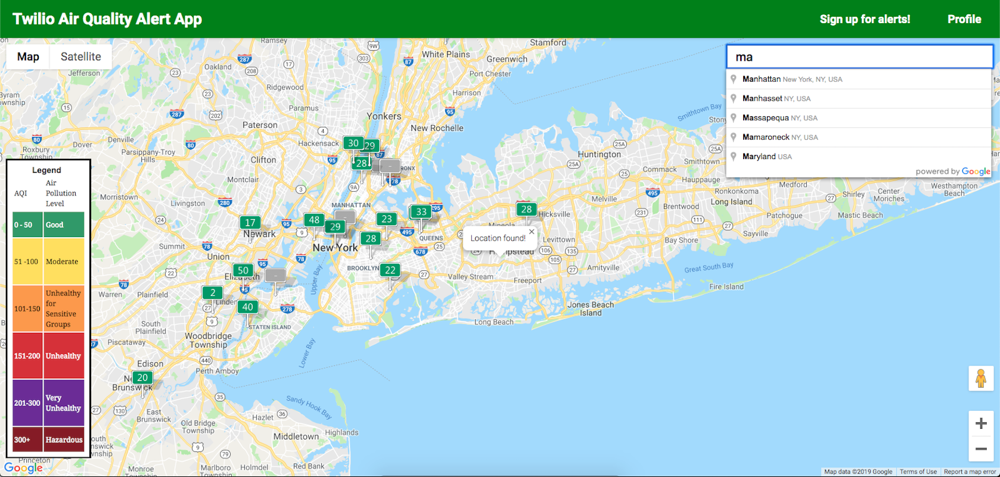
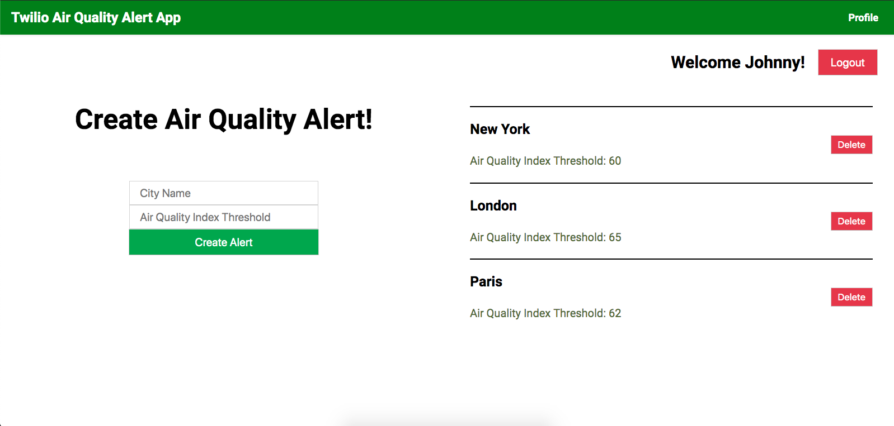

[](https://travis-ci.org/briantam23/twilio-aqi-alert-app)
[](https://david-dm.org/briantam23/twilio-aqi-alert-app)
[](https://david-dm.org/briantam23/twilio-aqi-alert-app?type=dev)
[](https://codeclimate.com/github/briantam23/twilio-aqi-alert-app/)


# 🌤 Air Quality Index App w/ Twilio Notifications

A Single Page App that:

*  Incorporates the Twilio API with React / Redux to send users Air Quality Index (AQI) alerts whenever the AQIs exceed certain user-set thresholds
*  Integrates the Google Maps API with AutoComplete & Geolocation along with the World AQI Map Overlay API in order to display AQIs around the world
*  Implements Responsive Web Design (RWD) using Media Queries / LESS

 <hr/>


## Table of contents
* [Motivation](#motivation)
* [What is Twilio?](#what-is-twilio?)
* [Login Credentials](#login-credentials)
* [Live Demo](#live-demo)
* [Dependencies](#dependencies)
* [Requirements](#requirements)
* [Installation](#installation)
* [Running Locally](#running-locally)
* [Deploying to Heroku](#deploying-to-heroku)
* [Tests](#tests)
* [Contact](#contact)

## Motivation
I wanted to create something useful everyone would use and wanted to utilize the popular Google Maps and AutoComplete API. I thought that, since I use my weather app every morning – why not create a small version of it.

## What is Twilio?
The [Twilio Messaging API](https://www.twilio.com/docs/api) makes it easy to send and receive SMS and MMS messages as well as query meta-data about text messages such as delivery status, associated media, and leverage tools like Copilot to manage your messages globally at scale.

## Login Credentials

Passwords are Salted & Hashed using [Bcrypt](https://www.npmjs.com/package/bcrypt)

* Username: `Brian`  | Password: `Briantam23@`
* Username: `Mike`   | Password: `Mike12#`
<!-- * Username: `Johnny` | Password: `Johnny34&`  -->

## Live Demo

Currently deployed to [Heroku](https://btam-aqi-twilio-alert-app.herokuapp.com/)!

## Dependencies

* [React](https://reactjs.org)
* [Redux](https://redux.js.org)
* [LESS](http://lesscss.org)
* [Enzyme](https://airbnb.io/enzyme)
* [PostgreSQL](https://www.postgresql.org)
* [Twilio](https://www.twilio.com)
* [Mocha](https://mochajs.org)
* [Express](https://expressjs.com)
* [Bcrypt](https://www.npmjs.com/package/bcrypt)

## Requirements

* Downloads
    * [Node.js (v10.16.0)](https://nodejs.org/en/)
    * [Git](https://git-scm.com/downloads)
    * [PostgreSQL](https://www.postgresql.org/download/)
* Environment Variables (must be set in `.env` or set as an environment variable)
    * [`GOOGLE_API_KEY`](https://developers.google.com/maps/documentation/javascript/get-api-key)
    * [`AIR_QUALITY_INDEX_KEY`](http://aqicn.org/api/)
    * [`TWILIO_ACCOUNT_SID`, `TWILIO_AUTH_TOKEN`, `TWILIO_PHONE_NUMBER`](https://www.twilio.com/docs/usage/tutorials/how-to-use-your-free-trial-account)
    * `OWN_PHONE_NUMBER` (if you want to be sent Twilio error messages regarding the app)

## Installation

Step 1: Clone Repo
```sh
git clone https://github.com/briantam23/twilio-aqi-alert-app.git` # or clone your own fork
```

Step 2: Create Database
```sh
createdb aqi-twilio-alert-app
```

Step 3: Install `node_modules`
```sh
npm install # or yarn install
```

## Running Locally

```sh
npm run start:dev
```

The `npm run start:dev` command will run 2 processes:
* the `webpack` process (in watch mode) to build your client-side Javascript files
* the Node process for your server with `nodemon`

Your app should now be running on [localhost:3000](http://localhost:3000).

## Deploying to Heroku

Make sure you have the [Heroku CLI](https://devcenter.heroku.com/articles/heroku-cli) installed.

```
heroku create
git push heroku master
heroku open
```

Alternatively, you can deploy your own copy of the app using the web-based flow:

[](https://heroku.com/deploy)

## Tests

Created Tests for React Components, the Redux Store, Routes, Models, and Functions:

> To run without "watch mode": 
```sh
npm run test
``` 

> To run with "watch mode":
```sh
npm run test:dev
```

## Contact
Created by [Brian Tam](http://briantam23.github.io) - feel free to contact me at [briantam23@gmail.com](mailto:briantam23@gmail.com)!

Personal Website - [briantam23.github.io](http://briantam23.github.io) <br/>
LinkedIn - [@briantam23](https://linkedin.com/in/briantam23/) <br/>
Github - [@briantam23](https://github.com/briantam23)